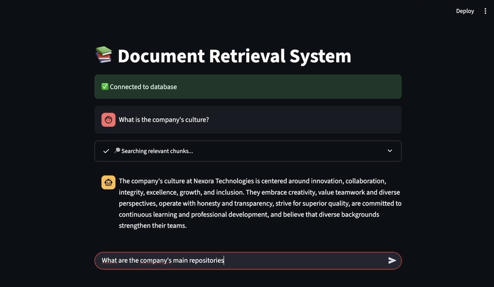

# 🤖 Chatty AI

Simple **Retrieval-Augmented Generation (RAG)** application that lets you chat with your documents using AI. 



## Features

- **📚 Document Intelligence**: Upload and chat with your documents using natural language
- **🔍 Smart Search**: Advanced vector search powered by OpenAI embeddings
- **💬 Conversational AI**: Interactive chat interface with context-aware responses
- **🚀 Fast & Efficient**: Built on LanceDB for lightning-fast vector operations
- **🎨 Beautiful UI**: Clean, modern Streamlit interface
- **🔒 Privacy-First**: Your documents stay local, only queries are sent to OpenAI

## Architecture

```
Chatty AI
├── 📄 Document Processing (embedding.py)
├── 🗄️ Vector Database (LanceDB)
├── 🤖 AI Chat Interface (rag.py)
└── 🌐 Web UI (Streamlit)
```

## Quick Start

### Prerequisites

- Python 3.9+
- OpenAI API key
- Git

### Installation

1. **Clone the repository**
   ```bash
   git clone https://github.com/ambra19/chatty-ai-rag.git
   cd chatty-ai
   ```

2. **Install dependencies**
   ```bash
   pip install -r requirements.txt
   ```

3. **Set up environment variables**
   ```bash
   # Edit .env and add your OpenAI API key
   OPENAI_API_KEY=your_api_key_here
   ```

4. **Prepare your documents**
   - Place your documents in the `src/data/` folder (repo comes with some mock-up data created by me)
   - Tested format only in: `.docx`

5. **Generate embeddings**
   ```bash
   cd src/rag
   python embedding.py
   ```

6. **Launch the app**
   ```bash
   streamlit run rag.py
   ```

### Customization

- **Model**: Change the AI model in `rag.py`
- **Search Results**: Adjust `num_results` in the `get_context` function
- **Temperature**: Modify response creativity in the OpenAI API call

### Made with ❤️ in Amsterdam